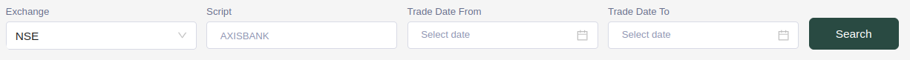
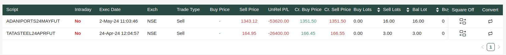

# My Positions

**My Positions** is the screen where you can see your performed trades i.e., your open positions.

There are some options at the top where you can filter on the basis of **exchange name**, search for a **particular scriptname** and can select the **date range** for trades that the user has performed.

#### My Positions Table

This table contains allow of the users trades that he has performed. Each row of the table contains the information about each position/trade.

**The row includes :** Script Name, Execution Date, Exchange name, Trade Type, Buy Price, Sell price, trades unrelalized P/L, current buy and sell prices, Sell and buy lots and the **trade amount**.

At the end there are two buttons

1. **Square off**: Square off the position which opens a modal for the confirmation to square off or not.
2. **Convert** : This is a button which is visible to only those users who are allowed to trade in intraday. On clicking, it opens a modal to convert the position to intraday or intraday to normal.

**Optional:**

- Positions can be opened and closed through trading activities. Opening a position involves entering into a trade by either buying or selling an asset, while closing a position involves exiting the trade by selling or buying back the asset. The difference between the price at which a position is opened and the price at which it is closed determines the profit or loss on the trade.
