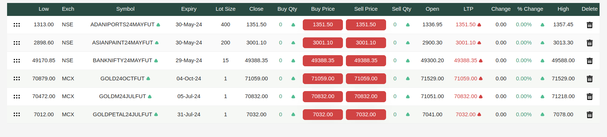

# Perform Trades

**Perform Trades** is the screen where you can actually perform the trades.

It has the following functionalities.

**1. Search and add scripts** :
At the top there are two options. First one is a **dropdown** to change the exchange name i.e., between **NSE** and **MCX**.
Along with it, there is a search script option where you can search and select the scripts based on the exchange name selected that you want to add in the watchlist.

At last you have a **Add** button on which you can click to add the scripts you selected in your watchlist.

**2. Can Create Multiple Watchlists** :
User can create multiple watchlists according to the need and can add same or different scripts in different watchlists. The user can rename the watchlist as well.

**3. Settings Modal** :
Along with watchlist names there is a settings icon where the user can select the columns he wants to see in the scripts.

**4. The Watchlist** :
The watchlist is a list of scripts that the user has added to trade on or to see.
On a particular script row the user can see details of the script and some options as well that includes deleting that script from from watchlist using a **delete button**.\

There are two columns named **buy price** and **sell price** which shows the current buy and sell price. If the user clicks on that prices then a modal is opened to buy or sell that particular stock.

**Buy/Sell Modal** : The trade modal includes multiple things

1. Script Name, current buy price , current sell price, lot size, change (in %).
2. Then there is order type **Market or Limit**. A toggle button for **intraday** which is visible to only those clients who are allowed to trade in intraday.
3. At last we have number of lots the user wants to trade on and there is a **trigger price** which is used to place a limit order **(can add less that or equal to maximum number of lots allowed by its upline)**.

